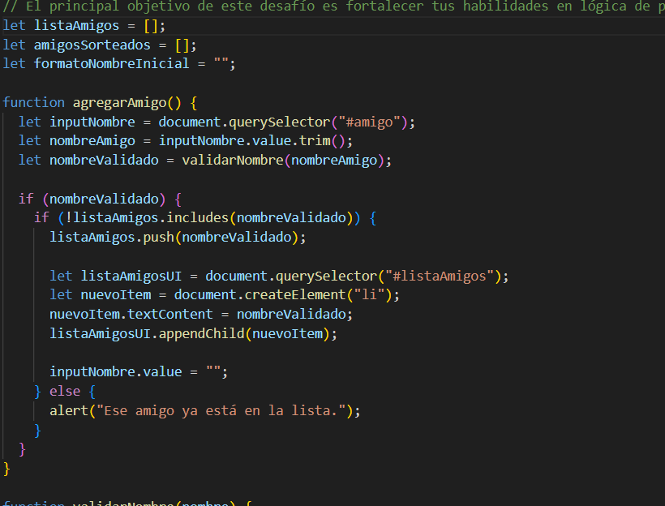
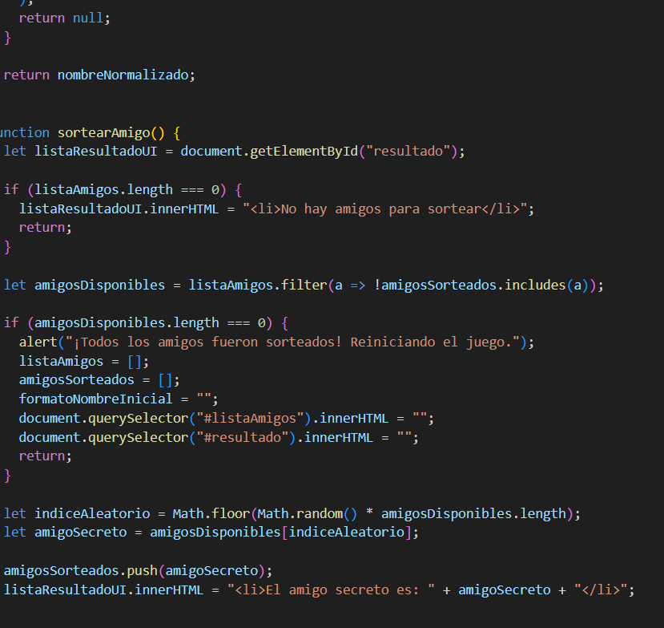
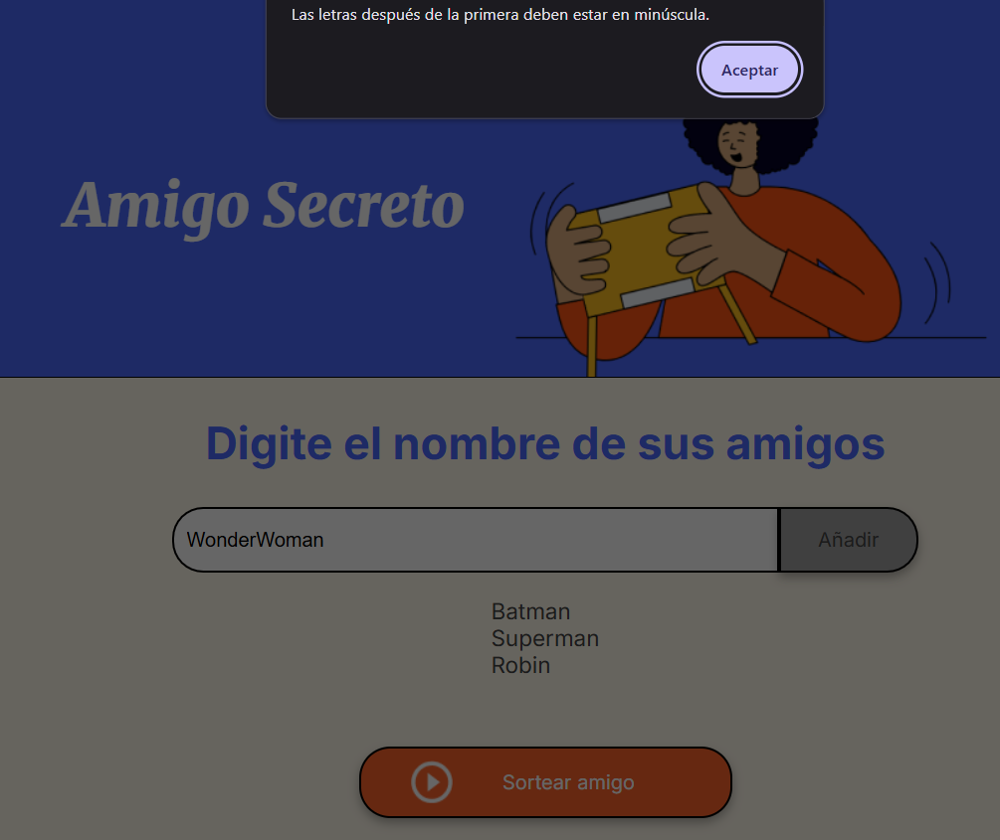
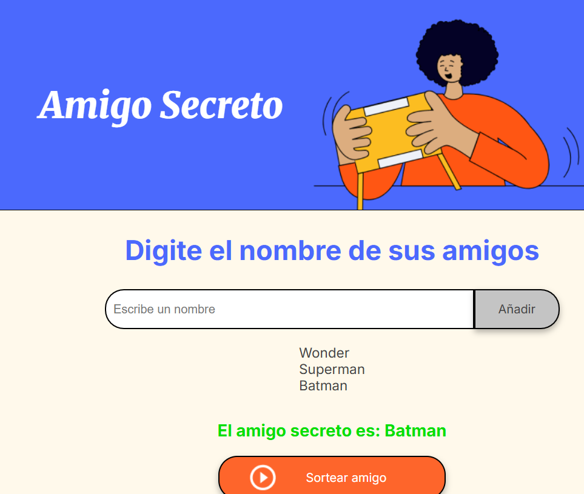

<h1>"El Amigo secreto"</h1>

- Este es el README para mi proyecto del "El Amigo secreto"
- Objetivo: Crear un juego que permita ver el estado de mi "amigo secreto" de forma aleatoria y que al mismo tiempo pueda verificar el estado de los nombres de "Mis amigos" si empiezan con Mayusculas o si son otro tipo de datos, etc.
- Estado: Trabajado
- --> primera parte del desarrollo
- ---> ultima parte del desarrollo (101 lineas :/ ) 
- ---->Funcionamiento primera parte
- ----->Funcionamiento Correcto
